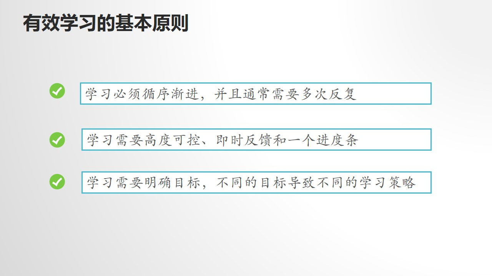
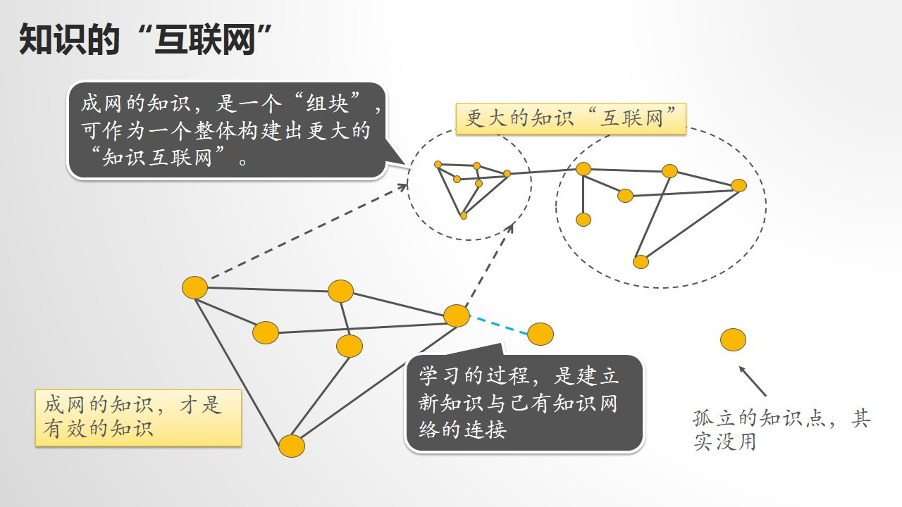

# 知乎 Live - 如何自学计算机专业课程？

live 地址：[https://www.zhihu.com/lives/837669764146003968](https://www.zhihu.com/lives/837669764146003968)

## 第一部分 计算机专业的自学路线图

### 1. 为什么要去啃枯燥抽象难懂的计算机专业课程？
- 更好的职业发展
- 更加扎实的基础让工作更轻松
- 从知识原理中找到乐趣

如何提升自己的核心竞争力？
- 语言、框架都是外功招式，计算机基础是内功，练好内功，事半功倍
- 内功往往很难修炼，学习计算机专业课程可以训练思维能力

### 2. 计算机专业都学了什么课程？
必修+选修，各大学的骨干核心课程都差不多，尤其是“四大天王”——计算机组成原理、数据结构和算法、操作系统、计算机网络

### 计算机课程学习路线
- 明确自己学习计算机课程的目的（这一点很重要，这一点决定了你的动力来源，学习方法）
- 设定清晰的目标，目标越明确越好
- 从科普、概论入手，从感性认识开始，基础知识和编程实践并行，最后再具体深入某个领域

## 第二部分 学习之道

### 1. 一些观点和建议
金老师推荐了芭芭拉·奥克利写的《学习之道》这本书。

学习的过程是联想、连接的过程，如果学过的知识没有关联起来，很快就会忘了。

适当的休息和及时整理，可以让信息有条理，并且让信息彼此之间连接的更紧密。

### 2. 有效学习的基本原则

- 学习必须循序渐进，并且通常需要多次反复
- 学习需要高度可控、即时反馈和一个进度条
- 学习需要明确目标，不同的目标导致不同的学习策略

### 3. 高效学习要遵循人的认知规律

- 从感性到理性
- 从具体到抽象
- 理论必须通过实践才能真正学好

### 4. 知识网络、知识体系

学习的过程，是建立新知识和已有知识网络的连接。
通过有效学习，我们收获的是构成网络的知识，也就是形成了知识体系，而不是零散的。
孤立的知识点，很快就忘记了，连接成网的知识才是有效的知识。

### 5. 计算机技术学习的分层理论：你真正需要深入学习的只有“N+1”和“N-1”层

> 吾生也有涯，而知也无涯。

- 人的精力有限，而知识是无限的，我们在学习知识时要学会抓重点
- 计算机领域的知识时分层的
- 当你主要在第 N 层工作时，通常只需要对第 N-1 和 N+1 层下功夫，就足以应付日常的工作和学习任务了，越偏离你的日常工作，所需要投入的精力就越少

### 6. 学习没有银弹

- 不存在万能学习法
- 具体的学习方法视个人情况而定，关键是要找到适合自己的学习方法
- 学会自学，终身学习

## 第三部分 读书之道

### 1. 选择书籍的原则和方法
- 选择适合于自己当前水平的书读
- 选择那些你已经具备读懂前提的书读
- 阅读科普书籍入门、通过学习专业教材掌握基础，通过技术书籍深入特定领城
- 尽量阅读最新的英文版，或者中英文对照着看
- 目的决定阅读方法

### 2. 分类读书法

不同的书有不同的特点、难度，适合不同的人、阶段去阅读，所以要根据自己的情况选择合适的书。

### 3. 多遍阅读法

### 4. 如何应对难书和厚书？

